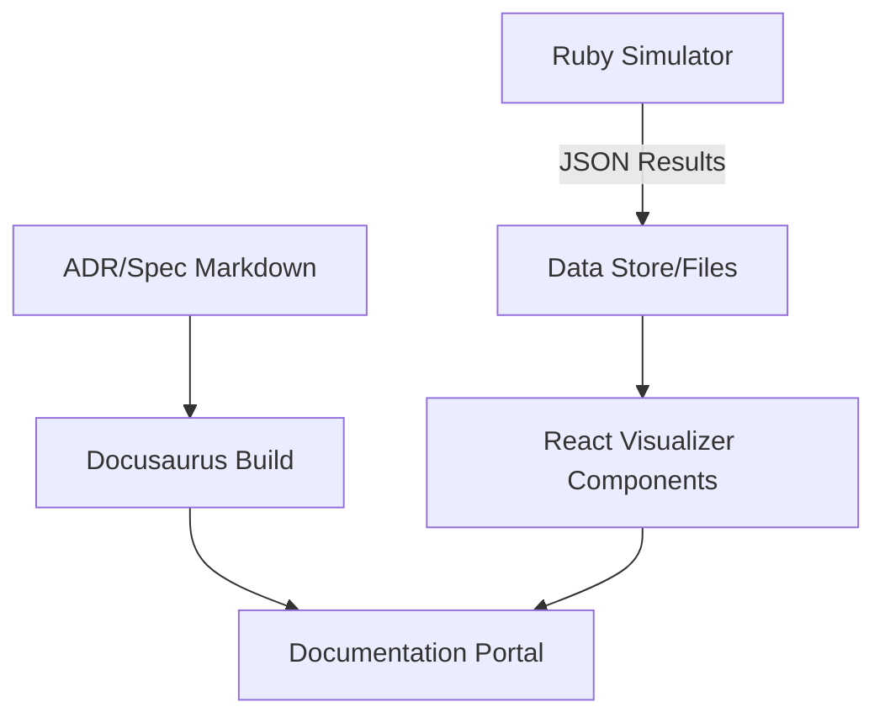

# ADR-0001: Implement Interactive Simulation Dashboard and Documentation Portal

## Context and Problem Statement

The D&D 2024 Combat Simulator currently relies on Ruby scripts and console output for running and analyzing simulations. As the complexity of class interactions (e.g., Battlemaster maneuvers, Weapon Masteries) increases, it becomes harder to visualize statistical trends and manage the growing set of architectural decisions and specifications. How can we provide a more accessible and interactive interface for researchers and developers?

## Decision Drivers

*   Need for better visualization of DPR (Damage Per Round) and survival rates.
*   Requirement for standardized documentation of architectural choices (ADRs) and requirements (OpenSpecs).
*   Desire for an interactive "Lab Runner" to configure batch experiments without writing new Ruby scripts.
*   Portability and ease of use within the existing Gemini CLI workflow.

## Considered Options

*   **Option 1: CLI-only Expansion**: Build more complex CLI tools using libraries like `thor` or `tty-prompt`.
*   **Option 2: Web-Based Dashboard (Docusaurus + React)**: Implement a documentation portal using Docusaurus (as seen in the Claude Plugin Design) and extend it with custom React components for simulation results.
*   **Option 3: Custom Rails/Sinatra App**: Build a full-stack Ruby web application.

## Decision Outcome

Chosen option: "**Option 2: Web-Based Dashboard (Docusaurus + React)**", because it leverages the existing "Design-as-Code" templates from the ported Claude Plugin, provides a professional documentation structure out of the box, and allows for rich interactive visualizations using React and Mermaid without the overhead of a full-stack Ruby application.

### Consequences

*   Good, because it unifies documentation (ADRs/Specs) and simulation results in a single UI.
*   Good, because it allows for easy deployment to GitHub Pages or similar.
*   Bad, because it introduces a Node.js dependency for the documentation build.
*   Bad, because it requires mapping Ruby simulation output (JSON) to React data structures.

### Confirmation

Compliance will be confirmed by the presence of a functioning Docusaurus site in the `docs/` directory that successfully renders the project's ADRs and Specs.

## Pros and Cons of the Options

### Option 1: CLI-only Expansion

*   Good, because it keeps the technology stack purely Ruby.
*   Bad, because visualizing complex statistical distributions in a terminal is limited.

### Option 2: Web-Based Dashboard (Docusaurus + React)

*   Good, because the "Claude Plugin: Design" already provides the infrastructure for ADR/Spec rendering.
*   Good, because React allows for interactive charts (e.g., using Recharts or D3).
*   Bad, because it requires managing two environments (Ruby for simulation, Node for UI).

## Architecture Diagram

## More Information

This decision aligns with the "Future Vision" in `ROADMAP.md` regarding an interactive way to configure and run experiments.
