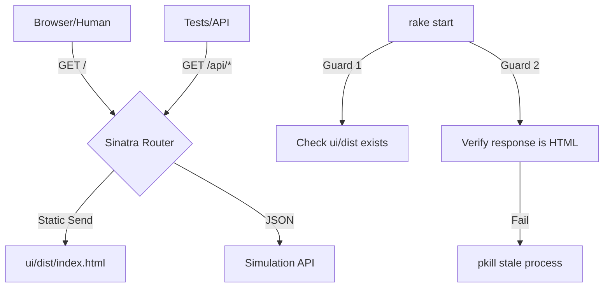

# ADR-0004: Strict Route Isolation and Infrastructure Governance

## Context and Problem Statement

In the transition to a unified Ruby server (ADR-0002), we encountered recurring issues where the browser would receive a JSON "online" message instead of the React UI. This occurred because the root path (`/`) was overloaded as both a machine-facing health check and a human-facing UI entry point. Additionally, stale Ruby processes frequently held onto port 4567, serving old code even after a `rake restart`. We need a permanent architectural fix to ensure usability.

## Decision Drivers

*   Developer Usability: The UI MUST be reliably accessible via browser at `localhost:4567`.
*   Testing Fidelity: Automated tests MUST verify human usability (HTML content) as well as API correctness.
*   Operational Robustness: Stale or misconfigured server processes MUST be detected and corrected automatically.

## Considered Options

*   **Option 1: Overloaded Content Negotiation**. Use `request.preferred_type` to guess what the user wants at `/`.
*   **Option 2: Strict Route Isolation**. Dedicate `/` exclusively to the UI and move all API/Health checks to `/api/*`.
*   **Option 3: Port Guarding**. Implement a "pre-flight" check in `rake start` that verifies the actual response content before declaring the server "started."

## Decision Outcome

Chosen option: "**Option 2 + Option 3**", because combining strict path separation with active response verification provides the highest level of assurance.

### Consequences

*   Good, because ambiguity is removed: if you hit `/`, you get the app. If you hit `/api`, you get JSON.
*   Good, because the Rake task will now "fail early" if the UI hasn't been built, rather than serving a 404 or JSON fallback.
*   Bad, because existing scripts or tests that rely on `GET /` for JSON will need to be updated to `/api/health`.

### Confirmation

Compliance will be confirmed by:
1.  `test/ui/test_sim_server.rb` including a `test_browser_usability` case.
2.  `lib/tasks/services.rake` including a `verify_ui_response` check.

## Architecture Diagram

## Math Transparency (D&D 2024 Project)

This decision ensures that the infrastructure supporting "Math Transparency" is itself transparent and reliable. By isolating the API, we ensure that metadata payloads for the Roll Inspector are never accidentally corrupted by HTML wrappers or ambiguous routing logic.
