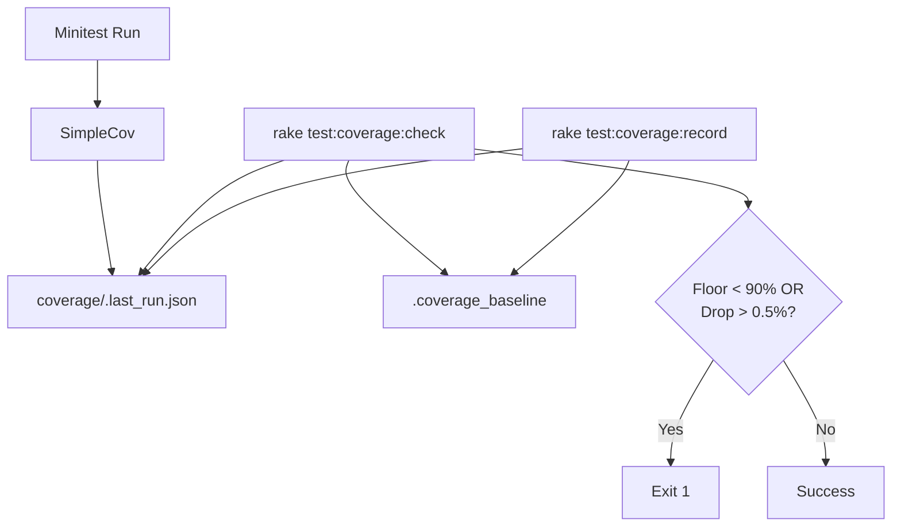

# ADR-0005: Automated Coverage Governance

## Context and Problem Statement

Code coverage in the D&D 2024 Simulator has fluctuated as classes and features are added. To ensure long-term maintainability and reliability, we need to enforce a hard coverage floor and prevent significant regressions between commits.

## Decision Drivers

* Maintain a minimum global coverage floor of 90%.
* Prevent "death by a thousand cuts" (small regressions adding up).
* Allow a small buffer (0.5%) for non-deterministic coverage variations or minor refactors.
* Ensure coverage data is visible in the source control history.

## Considered Options

* **Option 1: In-process SimpleCov Enforcement**: Use `SimpleCov.minimum_coverage` and `SimpleCov.refuse_coverage_drop`.
* **Option 2: External Rake Governance with Git Baseline**: Store the coverage high-water mark in a `.coverage_baseline` file and use a Rake task to compare results.

## Decision Outcome

Chosen option: "**Option 2: External Rake Governance with Git Baseline**", because it allows us to track the coverage trend directly in Git history and provides more flexibility for complex logic (like the 0.5% threshold) without polluting the `test_helper.rb` with environment-specific configuration.

### Consequences

* **Good**: Coverage regressions are now blocking failures in the `rake all` pipeline.
* **Good**: The `.coverage_baseline` file provides a clear "Audit Trail" of project quality.
* **Bad**: Developers must remember to run `rake test:coverage:record` when intentionally increasing coverage or after justified minor drops.

### Confirmation

Implementation will be confirmed by the presence of a passing `test:coverage:check` task in the CI pipeline (`rake all`).

## Pros and Cons of the Options

### Option 1: In-process SimpleCov Enforcement

* **Good**: Native to the tool, no extra scripts.
* **Bad**: Harder to manage dynamic baselines (SimpleCov uses a local hidden file `.last_run.json` which is ignored by Git).

### Option 2: External Rake Governance with Git Baseline

* **Good**: Full control over failure logic (floor vs regression).
* **Good**: Baseline is shared across all environments via Git.
* **Bad**: Adds one more Rake task to the project.

## Architecture Diagram

## Math Transparency

The regression threshold is defined as:
`is_failure = current_coverage < (baseline_coverage - 0.5)`

The floor threshold is defined as:
`is_failure = current_coverage < 90.0`
