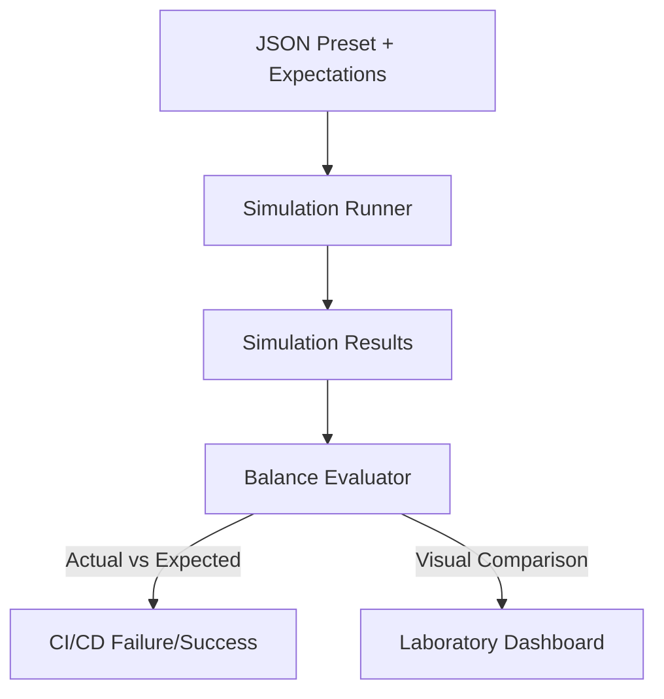

<FieldGroup>
  <Field label="Status">
    <StatusBadge status="PROPOSED" />
  </Field>
  <Field label="Date">
    <DateBadge date="2026-03-29" />
  </Field>
  <Field label="Decision Makers">Gemini CLI, chuckmcintyre</Field>
</FieldGroup>

# ADR-0003: Automated Balance Governance

## Context and Problem Statement

As the D&D 2024 engine grows, mechanical changes (e.g., refactoring the attack resolver or fixing a bug in Weapon Masteries) can unintentionally shift the mathematical balance of classes. Currently, we rely on manual execution of Ruby examples to verify balance. We need a way to codify "Mechanical Expectations" into our data layer so that regressions can be detected automatically in CI.

## Decision Drivers

*   Protect the mathematical integrity of implemented subclasses (Champion, Battlemaster).
*   Enable fast detection of balance regressions during core engine refactoring.
*   Bridge the gap between "Script-run experiments" and "UI-run presets."
*   Maintain "Math Transparency" as a core project value.

## Considered Options

*   **Option 1: Snapshot Testing**. Record simulation results as JSON snapshots and fail if the new result deviates by more than a small margin (e.g., 2%).
*   **Option 2: Expectation Schemas**. Define explicit ranges (e.g., `min_dpr`, `target_win_rate_range`) within preset JSON files.
*   **Option 3: Ruby Unit Assertions**. Move balance checks into standard Minitest files.

## Decision Outcome

Chosen option: "**Option 2: Expectation Schemas**", because it treats balance as a first-class data attribute of a simulation scenario. This allows both the Ruby Rake tasks and the UI Dashboard to visualize "Expected vs. Actual" performance.

### Consequences

*   Good, because it allows users to define what "Balanced" means for a specific encounter.
*   Good, because it unifies data presets with verification logic.
*   Bad, because simulation variance (even with 1000 runs) requires us to use "Confidence Intervals" rather than exact numbers.

### Confirmation

Compliance will be confirmed by a new `rake test:balance` task that executes presets with defined `expectations` and fails if actual results are statistically outside the expected bounds.

## Pros and Cons of the Options

### Option 1: Snapshot Testing

*   Good, because it requires zero manual configuration of "ranges."
*   Bad, because D&D simulations are inherently stochastic; a "Golden Master" snapshot might fail just due to a different random seed.

### Option 2: Expectation Schemas

*   Good, because it explicitly documents the *intended* balance of a feature (e.g., "Champion should deal 15-18 DPR at Lvl 5").
*   Good, because it works naturally with the existing JSON preset system.
*   Bad, because it requires manual effort to define the initial expectations.

### Option 3: Ruby Unit Assertions

*   Good, because it uses existing test infrastructure.
*   Bad, because it hides the "Balance Spec" in code rather than data, making it inaccessible to the UI Dashboard.

## Architecture Diagram

## Math Transparency (D&D 2024 Project)

To avoid false positives in CI, the Evaluator SHALL use the **Standard Error of the Mean (SEM)** for DPR and the **95% Confidence Interval** for win rates. A regression is only flagged if the actual mean is outside the expected range by more than $2 \times SE$.