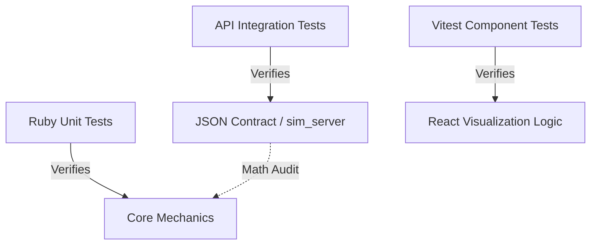

<FieldGroup>
  <Field label="Status">
    <StatusBadge status="DRAFT" />
  </Field>
  <Field label="Date">
    <DateBadge date="unknown" />
  </Field>
  <Field label="Domain">
    <DomainBadge domain="Automated Testing &amp; Validation Framework" />
  </Field>
</FieldGroup>

# Design: Automated Testing & Validation Framework

## Context

The D&D 2024 Simulator has transitioned from a CLI-only tool to a full-stack application with a React-based dashboard. This shift requires a more robust testing strategy that covers the boundaries between the Ruby engine and the Web UI.

## Goals / Non-Goals

### Goals
- Standardize API contract testing.
- Implement isolated testing for React visualization components.
- Establish a "Math Consistency" audit during simulation runs.

### Non-Goals
- Full browser automation (Playwright/Cypress) in the initial phase.
- Load testing the simulation server.

## Decisions

### Decision: API Integration Testing

**Choice**: Minitest + `rack-test`
**Rationale**: We already use Minitest for the core engine. `rack-test` allows for fast, lightweight testing of the Sinatra API without starting a real web server.

### Decision: Frontend Component Testing

**Choice**: Vitest + React Testing Library
**Rationale**: Vitest is significantly faster than Jest and provides a compatible API. It is ideal for testing the data-processing logic inside our charts.

## Architecture

The testing framework is divided into three layers:

## Risks / Trade-offs

- **Risk**: Duplication of "Math Logic" in tests. → **Mitigation**: Use the Ruby core's results as the "source of truth" and verify the UI correctly *displays* that truth rather than recalculating it.

## Math Transparency (D&D 2024 Project)

The "Math Transparency" principle is validated by the **Math Audit** layer. This layer takes simulation output and programmatically checks if `damage == roll + modifier`. If any event fails this consistency check, the test suite SHALL fail, preventing incorrect statistical peaking in the dashboard.
