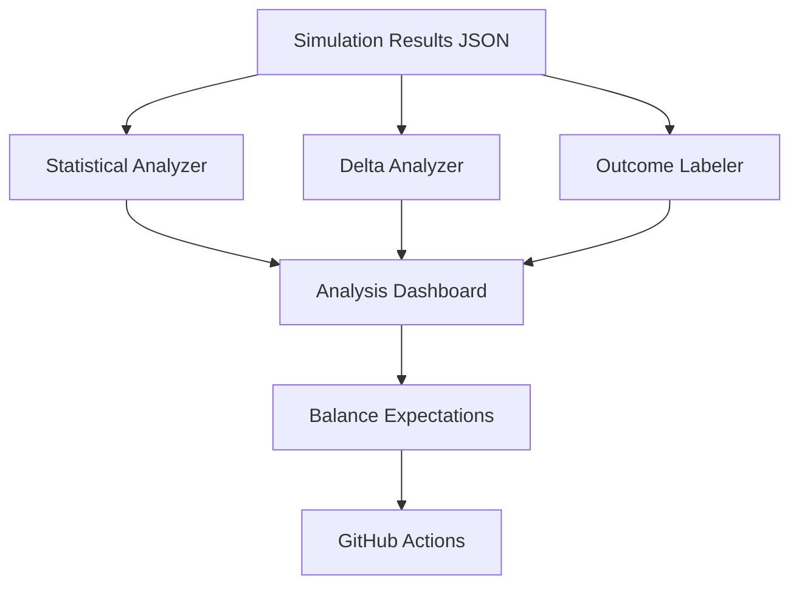

<FieldGroup>
  <Field label="Status">
    <StatusBadge status="DRAFT" />
  </Field>
  <Field label="Date">
    <DateBadge date="unknown" />
  </Field>
  <Field label="Domain">
    <DomainBadge domain="Simulation Analysis Laboratory" />
  </Field>
</FieldGroup>

# Design: Simulation Analysis Laboratory

## Context

The D&D 2024 Combat Simulator currently provides basic visualization (DPR charts, Survival bars, and logs). However, interpreting these results requires manual effort and doesn't account for statistical variance. This design introduces the "Laboratory" layer that automates interpretation.

## Goals / Non-Goals

### Goals
- Automate the comparison of two different character builds.
- Provide a clear qualitative summary of combat results (e.g., "This was a stomp").
- Ensure that simulation results are statistically significant before drawing balance conclusions.
- Enable regression testing for balance.

### Non-Goals
- Adding real-time strategy to the simulation (this is for analysis of existing strategies).
- Real-time graphing during a simulation (analysis is performed post-run).

## Decisions

### Analysis Engine Location

**Choice**: Client-side (JavaScript) in the Portal.
**Rationale**: Post-simulation data is small enough to process in the browser, allowing for interactive "What if?" analysis and easier UI integration.

### Statistical Model

**Choice**: 95% Confidence Interval for Proportion.
**Rationale**: Combat win rate is a binomial distribution (Win/Loss). A 95% CI provides a standard scientific measure of reliability.

### Combat Categorization

**Choice**: Heuristic-based labeling.
**Rationale**: Simple thresholds for "Rounds" and "HP Remaining" are sufficient for a D&D context.

## Architecture

The Laboratory sits on top of the Simulation Results and provides derived metrics and comparisons.

## Risks / Trade-offs

- **Statistical Misinterpretation** → Users might rely on 10 simulations instead of 100. We SHALL highlight low sample sizes in the UI.
- **Complexity of Comparison** → Comparing different party sizes (e.g., 1 vs 4) can be misleading. We SHALL provide per-combatant DPR breakdown.

## Math Transparency (D&D 2024 Project)

### Statistical Confidence
For a win rate $p$ and sample size $n$, the standard error is $SE = \sqrt\{p(1-p)/n\}$. The 95% margin of error is $1.96 \times SE$. If the margin of error is $> 10\%$, we warn the user.

### Delta Metrics
Comparison between Run A and Run B:
- $\Delta \text\{DPR\} = (\text\{AvgDPR\}_B / \text\{AvgDPR\}_A - 1) \times 100$
- $\Delta \text\{WinRate\} = (\text\{WinRate\}_B - \text\{WinRate\}_A)$

### Outcome Scoring
- **Stomp**: Winner has $> 75\%$ HP remaining and rounds $&lt; 5$.
- **Close**: Winner has $&lt; 25\%$ HP remaining OR rounds $> 8$.
- **Slog**: Rounds $> 12$ regardless of HP.
