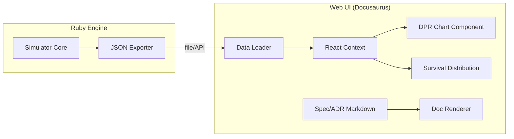

<FieldGroup>
  <Field label="Status">
    <StatusBadge status="DRAFT" />
  </Field>
  <Field label="Date">
    <DateBadge date="unknown" />
  </Field>
  <Field label="Domain">
    <DomainBadge domain="Simulation Dashboard &amp; Experiment Runner" />
  </Field>
</FieldGroup>

# Design: Simulation Dashboard & Experiment Runner

## Context

The D&D 2024 Combat Simulator needs a way to move beyond static console output for its scientific analysis. This design leverages the Docusaurus templates from the "Claude Plugin: Design" port to create a unified documentation and visualization portal.

## Goals / Non-Goals

### Goals
- Integrate ADR and Spec rendering into a web UI.
- Provide interactive charts for simulation data.
- Enable a "Lab Runner" interface for batch configuration.
- Maintain "Math Transparency" through interactive drill-downs.

### Non-Goals
- Real-time 3D combat visualization (focus on statistical data).
- Multiplayer support (local/researcher focus).

## Decisions

### Decision: Documentation Engine

**Choice**: Docusaurus (Ported from Claude Plugin)
**Rationale**: It provides a robust Markdown-to-HTML pipeline, Mermaid support, and a React-based architecture that is easy to extend with custom visualization components.

### Decision: Visualization Library

**Choice**: Recharts
**Rationale**: It is a React-based charting library that integrates well with Docusaurus and supports responsive, interactive line and bar charts needed for DPR analysis.

## Architecture

The system uses a decoupled architecture where the Ruby simulator acts as a data generator and the Docusaurus/React app acts as the consumer.

## Risks / Trade-offs

- **Risk**: Data synchronization between Ruby and Node environments. → **Mitigation**: Standardize on a well-defined JSON schema for all simulation results.
- **Risk**: Node.js dependency for developers. → **Mitigation**: Provide a pre-built static version or a Docker container.

## Math Transparency (D&D 2024 Project)

The "Math Transparency" principle is maintained by including full roll metadata in the exported JSON. The React components will include a "Roll Inspector" overlay that appears when clicking on data points, showing the exact formula used (e.g., `Attacker: 1d20(15) + 5 = 20 vs AC 18`).
