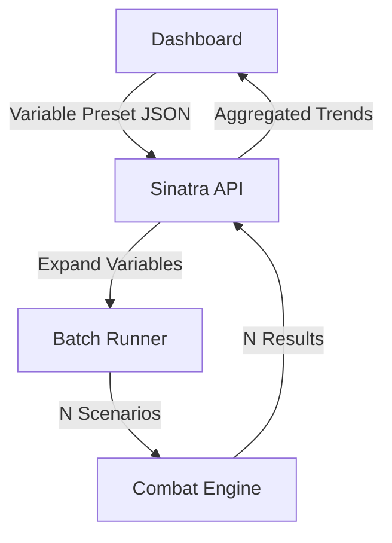

<FieldGroup>
  <Field label="Status">
    <StatusBadge status="DRAFT" />
  </Field>
  <Field label="Date">
    <DateBadge date="unknown" />
  </Field>
  <Field label="Domain">
    <DomainBadge domain="Variable Simulation Presets" />
  </Field>
</FieldGroup>

# Design: Variable Simulation Presets

## Context

The current simulation engine is great at running a single encounter many times. However, "Balance" is often a function of scale (e.g., a Battlemaster might scale better against multiple targets than a Champion). This design enables "Parameter Sweeps" to capture these scaling trends.

## Goals / Non-Goals

### Goals
- Enable "Parameter Sweeps" where one or more variables are changed across a range.
- Provide a visualization for how balance shifts as a variable changes.
- Unify script-based experiments with UI-based presets.

### Non-Goals
- Real-time adjustment of variables during a simulation.
- Support for infinite ranges (all variables must be discrete lists or bounded ranges).

## Decisions

### Variable Expansion Location

**Choice**: Server-side (Ruby).
**Rationale**: Expanding a variable preset into multiple simulation jobs is best handled by the Ruby engine to ensure consistency between the CLI and UI. The UI just receives a "Batch" of results.

### Schema Format

**Choice**: Handlebars-style syntax `{{variable_name}}` within the JSON.
**Rationale**: Simple string replacement is lightweight and easy to implement in Ruby without complex DSLs.

## Architecture

The `ScenarioBuilder` will be wrapped by a `BatchRunner` that handles variable expansion.

## Risks / Trade-offs

- **Combinatorial Explosion** → Defining two variables with 5 values each results in 25 simulations. We SHALL limit total batch size to 50 simulations per request.
- **UI Complexity** → Visualizing 3+ dimensions is hard. We SHALL focus on 1D sweeps (X = Variable, Y = Metric) with 2D support via "Series" (Legend).

## Math Transparency (D&D 2024 Project)

When visualizing trends, the UI MUST display the **Confidence Interval** for every point on the line. As the sample size per point might be lower in a large sweep, the error bars become critical for interpreting if a "crossover point" in balance is real or just noise.
