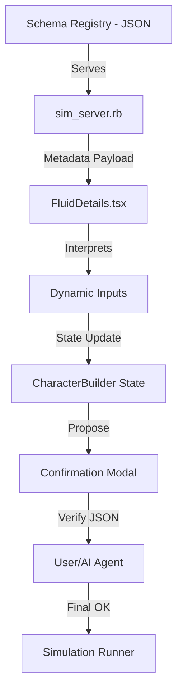

# Design: AI-Centric UI Framework

## Context

The current UI relies on hardcoded React logic in `CharacterBuilder.tsx` and `ScenarioConfigurator.tsx`. While a basic declarative schema exists, it is not universal. State desyncs (like the Team Assignment bug) occur because the UI state is imperative and fragile. This design formalizes the "Simulator UI Framework" research into a robust architecture.

Reference: SPEC-0011, ADR-0002.

## Goals / Non-Goals

### Goals
- Move 100% of character configuration fields to a central JSON schema.
- Implement "Dynamic Slotting" via Zone-based rendering.
- Provide a machine-readable "Simulation Intent Manifest" for AI verification.
- Use CSS design tokens for a "Modern Scientific" aesthetic.

### Non-Goals
- Replacing the entire frontend with a full Generative UI (Level 3+) that writes its own components.
- Changing the backend Ruby simulation logic.

## Decisions

### Schema Registry Implementation

**Choice**: Use `data/schemas/ui_schema.json` with a Ruby `SchemaRegistry` and JSON Schema validation.
**Rationale**: Provides a single source of truth that is language-agnostic (used by Ruby and React) and machine-editable.

### Zone-Based Rendering

**Choice**: The `FluidDetails` component will filter fields by a `zone` attribute in the schema.
**Rationale**: Allows the AI to "Slot" new features into specific UI regions (e.g., Equipment vs. Stats) without understanding the React component hierarchy.

## Architecture

The framework follows a **Registry-Interpreter** pattern.

## Risks / Trade-offs

- **Component Complexity** → Refactoring `CharacterBuilder` into a generic schema interpreter may increase initial cognitive load for human developers.
- **Validation Overhead** → Shared JSON Schema adds a build/runtime dependency for both Ruby and React.

## Math Transparency (D&D 2024 Project)

The UI framework does not modify core math but ensures **Transparency of Input**. The "Simulation Intent Manifest" displays the exact mathematical inputs (e.g., specific modifier values, dice strings) before they are passed to the `Dnd5e::Core::Combat` engine.

| UI Field | Intent Mapping | Engine Property |
| :--- | :--- | :--- |
| Ability Score | `ability.strength: 18` | `statblock.strength = 18` |
| Fighting Style | `fightingStyle: "archery"` | `FeatureManager.add(Archery.new)` |
| Weapon | `weapon: "battleaxe"` | `WeaponRegistry.fetch("battleaxe")` |
