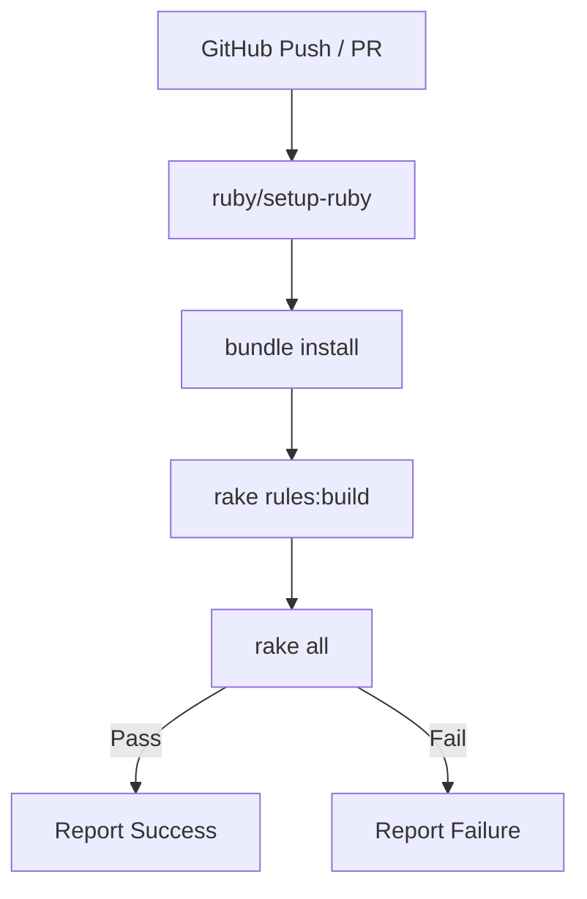

# Design: CI/CD GitHub Actions Workflow

## Context

The D&D 2024 Combat Simulator relies on a table-driven ruleset that requires ingestion before execution. Currently, tests and linting are run manually. This design introduces a GitHub Actions workflow to automate these tasks on every code change.

## Goals / Non-Goals

### Goals
- Automate tests, linting, and examples.
- Ensure the rules cache is built before execution.
- Provide fast feedback to developers on push and PR.

### Non-Goals
- Deploying the application (not applicable).
- Multi-platform testing (Linux-only is sufficient for now).
- Multi-version Ruby testing (only 3.3.9 is targeted).

## Decisions

### Workflow Engine

**Choice**: GitHub Actions.
**Rationale**: Native integration with the repository and widely used for Ruby projects.

### Workflow Configuration

**Choice**: Single job `test` running on `ubuntu-latest`.
**Rationale**: Simple, easy to maintain, and provides everything needed.

### Tooling Integration

**Choice**: `ruby/setup-ruby` action.
**Rationale**: Industry standard for Ruby actions, supports `.ruby-version` and automated caching.

## Architecture

The workflow is triggered by GitHub events, sets up the Ruby environment, installs dependencies, builds the rule cache, and then executes the validation suite.

## Risks / Trade-offs

- **Slow Examples** → If examples take too long, CI will be slow. We use parallel execution in `rake examples` to mitigate this. If needed, we can use `FAST_SIM=true` to skip particularly slow simulations.
- **Rules Ingestion Failure** → If `rules:build` fails, tests will fail with opaque errors. We've structured the workflow to run `rules:build` as an explicit step.

## Math Transparency (D&D 2024 Project)

The `rake all` task includes `rake examples`, which runs several thousand simulations to verify mathematical outcomes. For CI, these serve as a regression suite to ensure that changes to the core engine don't silently break mechanical balance.
