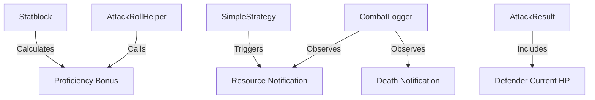

# Design: Combat Reporting and Modifier Accuracy

## Context

The current combat simulator (as of Round 1 logs) displays a +0 modifier for Level 5 characters, indicating that both Ability Scores and Proficiency Bonuses are missing from the calculation. Additionally, the UI logs lack critical transparency regarding turn flow (Action Surge, Second Wind) and combatant death, making it difficult to verify complex simulation results.

## Goals / Non-Goals

### Goals
- Correctly apply Ability Modifier + Proficiency Bonus to all attack rolls.
- Ensure the `Statblock` correctly initializes ability scores from preset JSON data.
- Enhance `CombatLogger` to explicitly report turn start, resource usage, and deaths.
- Include remaining HP in hit reports for better tactical feedback.

### Non-Goals
- Adding complex multi-round effects (like Haste or slow-moving conditions) in this specific PR.
- Redesigning the entire UI dashboard; focusing strictly on the log/reporting layer.

## Decisions

### Decision: Proficiency Bonus Application
**Choice**: Update `AttackRollHelper.calculate_modifier` to include `attacker.statblock.proficiency_bonus`.
**Rationale**: The 2024 rules require both ability scores and proficiency bonuses for weapon attacks. Proficiency bonus is already calculated in the `Statblock` class but was not used in the attack helper.

### Decision: Resource Usage Reporting
**Choice**: Use a new `notify_observers(:resource_used, { combatant: ..., resource: ... })` pattern in `SimpleStrategyLogic`.
**Rationale**: Centralizing resource usage notifications allows the `CombatLogger` and other observers to respond consistently when Action Surge or Second Wind are triggered.

## Architecture

## Math Transparency (D&D 2024 Project)

To improve transparency, the `AttackResult` object will be updated to include a breakdown of the total modifier (Ability + Proficiency). The `CombatLogger` will then format this breakdown in the logs.

**Example Log Format:**
`[ATTACK] Champ Hero vs Bugbear 1 (Longsword)`
`Roll: 18 (Raw: 13 + 3 Mod + 2 Prof) vs AC 16 | Hit!`
`Damage: 7 (4+3 Mod) | Bugbear 1 HP: 20/27`
`[RESOURCE] Champ Hero used Action Surge!`
`[DEFEATED] Bugbear 1 has been defeated.`

## Risks / Trade-offs

- **Risk**: Increased log verbosity. → **Mitigation**: Use different log levels (e.g., info for major events, debug for math breakdowns).
- **Risk**: Performance impact of additional notifications. → **Mitigation**: Simple observer pattern is lightweight and sufficient for current simulation scales.
