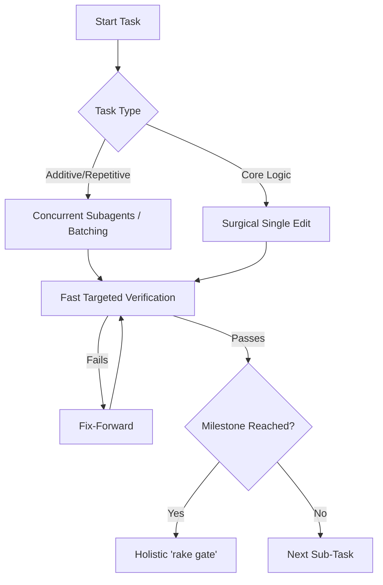

# Design: Pragmatic Integrity Protocol

## Context

Previous iterations of the D&D 2024 Simulator development cycle revealed a pattern of "Completion Bias," where bulk-generation shortcuts introduced numerous RuboCop offenses and broken test suites. We over-corrected by introducing a strict 2-file limit and holistic gate checks (`rake gate`) after every minor change. This over-correction made the development loop unacceptably slow and cumbersome. This design formalizes the "Pragmatic Integrity Protocol" to strike a better balance between safety and velocity.

## Goals / Non-Goals

### Goals
- Allow concurrent delegation or batched processing for repetitive, additive tasks.
- Shift from slow holistic gates to fast, targeted verification during the inner dev loop.
- Prevent the accumulation of technical debt that leads to `# rubocop:disable`.

### Non-Goals
- Revert to blind, unverified bulk generation of highly coupled logic.
- Run full UI E2E tests for minor backend changes.

## Decisions

### Concurrent/Batched Implementation Flow

**Choice**: Files MAY be created/modified in batches (e.g., via subagents) provided they are structurally similar or additive (e.g., new subclasses) and validated as a cohesive unit.
**Rationale**: Strict sequential limits artificially bottleneck AI velocity. Concurrency scales better when changes do not conflict.

### Fast Targeted Verification

**Choice**: Use targeted tests (`ruby -Ilib:test path/to/test.rb`) instead of `rake gate` during the inner loop.
**Rationale**: `rake gate` checks everything (coverage, linters, E2E). Running it constantly is a massive context and time sink.

## Architecture

The protocol acts as a "Process Wrapper" around the existing development lifecycle.

## Risks / Trade-offs

- **Regression Slip** → By delaying the holistic gate to milestones, minor regressions might slip past the inner loop. 
- **Mitigation** → The final milestone `rake gate` guarantees compliance before any PR or merge, catching delayed regressions.

## Math Transparency (D&D 2024 Project)

This spec governs the *delivery* of math, ensuring that mechanical implementations are backed by verified tests.

1.  **Targeted Math Validation**: Mathematical changes MUST be verified immediately via a targeted test or script.
2.  **Coverage Ratchet**: The protocol relies on the automated `.coverage_baseline` ratchet (run during `rake gate`) to ensure math execution coverage is strictly increasing.
