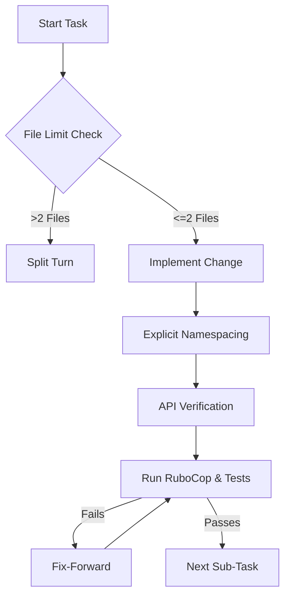

# Design: Surgical Integrity Protocol

## Context

Previous iterations of the D&D 2024 Simulator development cycle revealed a pattern of "Completion Bias," where the desire to finish complex tasks (e.g., implementing all subclasses) led to bulk-generation shortcuts. These shortcuts introduced numerous RuboCop offenses, constant resolution errors, and broken test suites. This design formalizes the "Surgical Integrity Protocol" required to prevent these failures.

## Goals / Non-Goals

### Goals
- Enforce atomic conversational turns to limit blast radius of errors.
- Ensure 100% constant resolution accuracy in Ruby.
- Prevent the accumulation of technical debt that leads to `# rubocop:disable`.

### Non-Goals
- Enforce performance metrics on the AI's internal reasoning.
- Restrict the number of *total* files in the project.

## Decisions

### Sequential Implementation Flow

**Choice**: Files MUST be created/modified one-by-one or in pairs, followed by a validation pass.
**Rationale**: Bulk operations like `cat <<EOF` loops bypass the agent's ability to correct course based on linter or compiler feedback.

### Explicit Scope Definition

**Choice**: Always use nested module blocks in Ruby.
**Rationale**: `module A::B` in Ruby does not verify that `A` is already defined in the local context, leading to resolution failures when the base class (e.g., `Feature`) is in an outer namespace.

## Architecture

The protocol acts as a "Process Wrapper" around the existing development lifecycle.

## Risks / Trade-offs

- **Turn Efficiency** → Enforcing a 2-file limit increases the number of conversational turns. This is an intentional trade-off: **Surgical Integrity > Turn Speed**.

## Math Transparency (D&D 2024 Project)

This spec governs the *delivery* of math, ensuring that mechanical implementations (like the Barbarian's Rage Resistance) are backed by verified tests.

1.  **Verification Script**: Every mechanical change MUST have a corresponding Ruby script or test case run in the same turn.
2.  **Coverage Ratchet**: The protocol relies on the automated `.coverage_baseline` ratchet to ensure math execution is strictly increasing.
