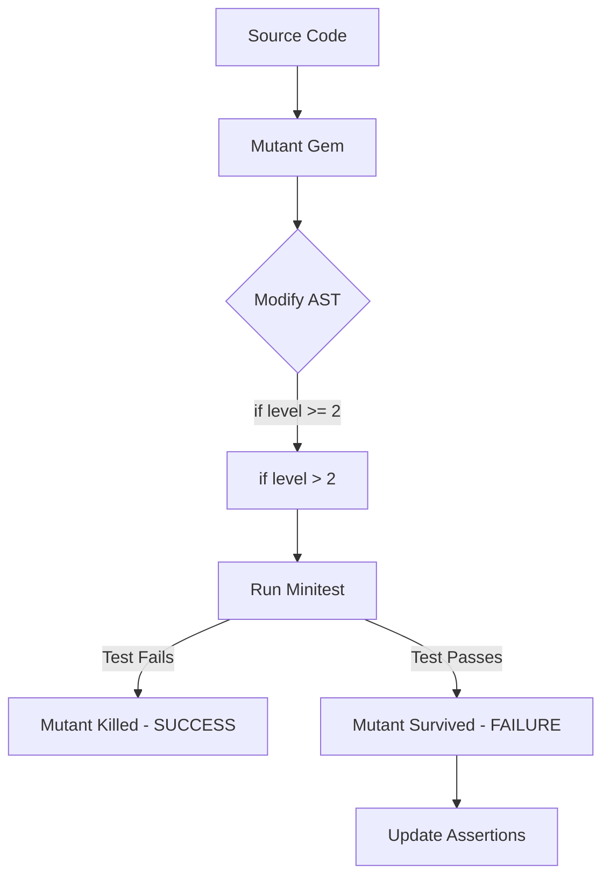

# Design: Mutation Testing Governance

## Context

Current governance (SPEC-0011) relies on line coverage. However, as seen in previous bugs (e.g., Barbarian Rage resistance not being applied but tests still "passing"), line execution does not guarantee logical verification. Mutation testing provides an objective measure of test quality.

## Goals / Non-Goals

### Goals
- Integrate `mutant` with the existing Minitest suite.
- Provide a targeted mutation task for core logic.
- Identify "Dead Code" or "Weak Assertions" in critical paths.

### Non-Goals
- Run mutation testing on the UI or configuration layers.
- Require 100% mutation coverage (some boilerplate mutations are noisy).

## Decisions

### Tooling Choice: Mutant Gem

**Choice**: Use the `mutant` and `mutant-minitest` gems.
**Rationale**: `mutant` is the industry standard for Ruby mutation testing, offering deep AST modification and a robust reporting interface.

### Scoped & Asynchronous Execution

**Choice**: Full namespace execution is relegated to CI or off-hours; active development uses method-level targeting (e.g. `Dnd5e::Core::Dice#total`).
**Rationale**: Even scoped to core physics classes, `mutant` takes over 100 seconds to run. Blocking the inner development loop on this breaks developer flow.

## Architecture

Mutation testing acts as an asynchronous or highly-targeted audit layer on top of the existing Unit Test suite.

## Risks / Trade-offs

- **Performance** → Mutation testing is computationally expensive.
- **Mitigation** → We strictly scope execution to core modules rather than the whole project.

## Math Transparency (D&D 2024 Project)

Mutation testing is the ultimate form of math transparency. It proves that the following logic is "Load-Bearing":

1.  **Rounding**: Changing `.to_i` to `.round` should kill a mutant if our simulation depends on floor-rounding (2024 RAW).
2.  **Thresholds**: Changing `roll >= ac` to `roll > ac` must fail the tests.
3.  **Resistance**: Changing `damage / 2` to `damage / 3` must fail the tests.
