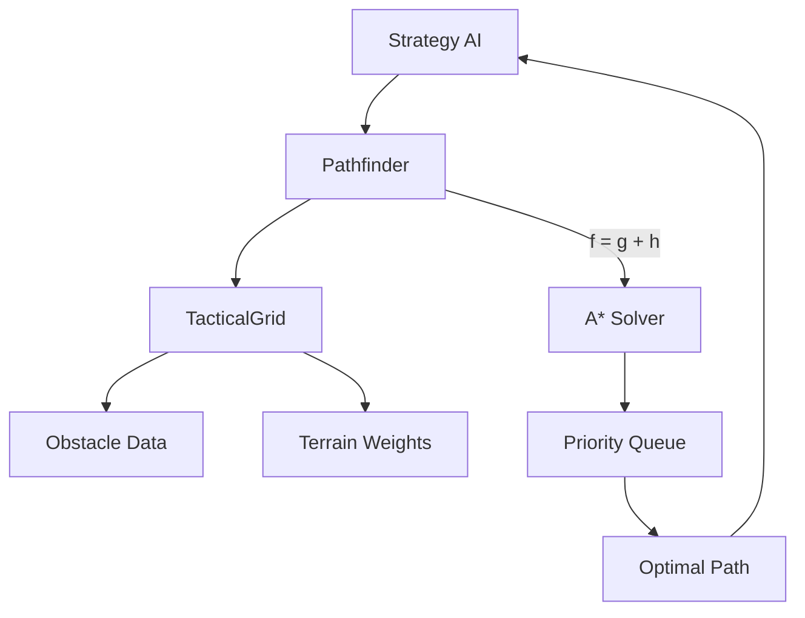

# Design: A* Pathfinding and Grid Navigation

## Context

The transition to a 2D coordinate system (SPEC-0008) established the spatial foundation. However, the current "Direct Line" movement logic fails when obstacles are introduced. A* (A-Star) is the industry standard for grid-based navigation, providing a guaranteed optimal path given a heuristic.

## Goals / Non-Goals

### Goals
- Implement a reusable `Pathfinder` class.
- Support diagonal movement (8-way grid).
- Support weighted squares (difficult terrain).
- Support multi-square combatants (Large/Huge).

### Non-Goals
- Implement dynamic avoidance (moving targets) in the first iteration.
- Implement 3D navigation (flying).

## Decisions

### Algorithm: A* (A-Star)

**Choice**: Use A* with the Manhattan or Octile heuristic.
**Rationale**: Octile distance is more accurate for 8-way movement. 

### Data Structure: Priority Queue

**Choice**: Use a min-heap or sorted array for the "Open Set".
**Rationale**: Ensures we always expand the node with the lowest estimated total cost ($f = g + h$).

## Architecture

The `Pathfinder` acts as a service layer for the `TacticalGrid`.

## Risks / Trade-offs

- **Memory/CPU** → Large grids (100x100+) can be slow.
- **Mitigation** → We use small combat maps (typically 30x30 or 50x50), where A* is highly efficient.

## Math Transparency (D&D 2024 Project)

Pathfinding accuracy is critical for DPR calculations, as "wasted movement" prevents attacks.

1.  **Octile Heuristic**: $h = (dx + dy) + (sqrt(2) - 2) * min(dx, dy)$.
2.  **Difficult Terrain**: $g$ cost for entry into a weighted square is $10$ instead of $5$ (default D&D move unit).
3.  **Footprint Check**: For Large (2x2) creatures, the $g$ cost calculation must check all 4 cells ($x, y$, $x+1, y$, $x, y+1$, $x+1, y+1$) for validity.
