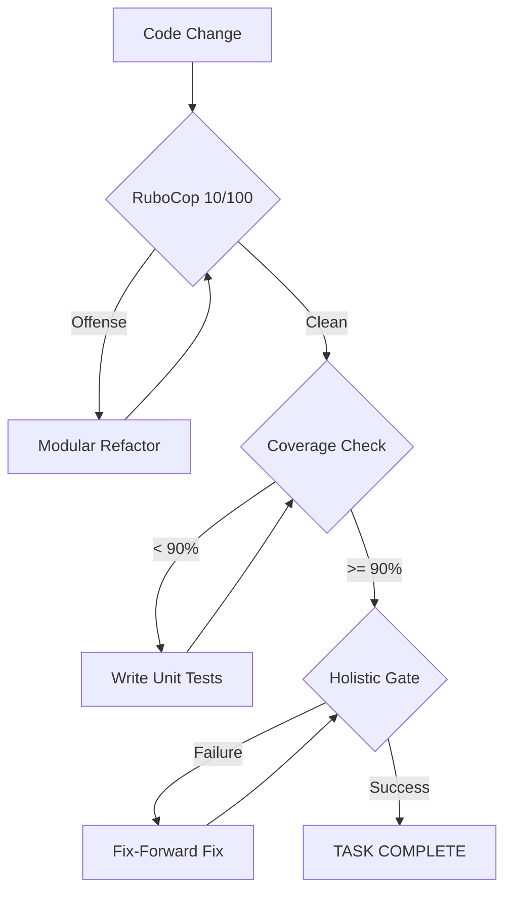

# Design: Quality Governance and Automated Gates

## Context

The D&D 2024 simulator is an evolving project with high mathematical complexity. Naive implementations or "skipping" quality checks leads to cascading failures in scientific accuracy. This design formalizes the "fix-forward" and "modular-first" approaches adopted during the Tree 1 completion.

## Goals / Non-Goals

### Goals
- Ensure 100% RuboCop compliance without `disable` comments.
- Maintain a strict 90.0% coverage floor.
- Automate the "Holistic Gate" for verification.

### Non-Goals
- Sacrifice performance for modularity.
- Implement a blocking pre-commit hook that prevents local prototyping (governance is for *completion*).

## Decisions

### Modularization via Mixins
**Choice**: Decomposition of large classes (e.g., `Statblock`) into behavioral modules (e.g., `StatblockMechanics`, `StatblockInitialization`).
**Rationale**: Ruby's mixin system allows us to keep the main class interface clean while ensuring each individual source file remains under 100 lines, satisfying RuboCop metrics naturally.

### Dependency Injection for Testability
**Choice**: Explicitly injecting dependencies like `DiceRoller` into `Attack` and `Combat` objects.
**Rationale**: Avoids brittle mocks and ensure that simulation logs are consistent across all objects.

### Quality Ratchet
**Choice**: Using a `.coverage_baseline` file to prevent any drop in coverage.
**Rationale**: Ensures that new code is as tested as old code, preventing the "slow leak" of quality.

## Architecture

The governance system sits between the developer's execution and the final "Done" state.

## Risks / Trade-offs

- **File Bloat** → Refactoring 1 file into 4 increases the total file count. This is mitigated by clear directory names (e.g., `lib/dnd5e/builders/class_logic/`).
- **Test Fragility** → High coverage can sometimes lead to testing implementation details. Mitigation: Focus on behavioral unit tests (e.g., `test_monk_strategy.rb`) over state-checking.

## Math Transparency (D&D 2024 Project)

All mechanical changes resulting from refactoring MUST be verified against the `examples/` directory to ensure the mathematical output remains identical.
- **HP Scaling**: Verified by `test/multiclass_test.rb`.
- **Attack Roll Accuracy**: Verified by `rake ui:e2e` (Roll Inspector validation).
