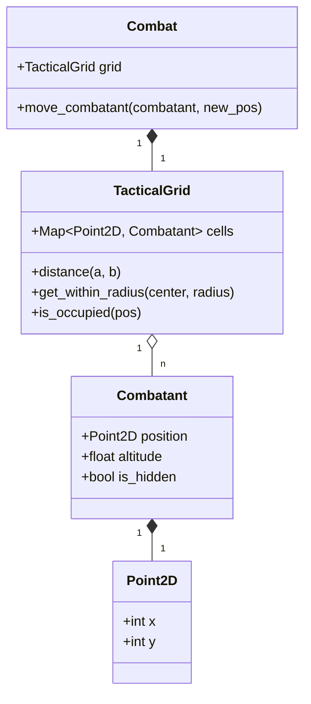

# DESIGN-0008: Tactical Grid & Spatial Simulation

## Problem Statement

The current simulation uses a scalar `distance` integer to manage combatant proximity. This prevents:
- Flanking and positioning-based tactics.
- Accurate AOE resolution for multiple targets in distinct positions.
- Meaningful use of movement speed and kiting in non-linear paths.
- Proper modeling of 2024 tactical features (e.g., Push/Topple effects in 2D space).

## Proposed Solution

Introduce a `TacticalGrid` class that manages combatant occupancy on a 2D plane (5' squares). Each combatant will have a `position` (Vector2) and an `altitude` (float).

### Architecture Diagram

## Detailed Design

### Spatial Data Structure

The `TacticalGrid` will use a simple Hash Map for occupancy, where keys are `Point2D` objects. For a 2024 simulation, we will assume a standard 5' square grid.

### Distance Math (D&D 5e / 2024)

By default, we will implement the "Euclidean-ish" 5e rule:
- `distance = max(|x1-x2|, |y1-y2|, |z1-z2|)` where `z` is the altitude difference.
- This ensures that diagonal movement and diagonal range are treated simply as 5 feet, matching standard tabletop play.

### AOE Resolution

The `TacticalGrid` will provide a `get_within_range(point, shape)` method:
- **Sphere**: Intersection of grid squares with a circle.
- **Cube**: AABB (Axis-Aligned Bounding Box) check.
- **Line**: Bresenham's algorithm or similar ray-casting.

### Stealth & Hidden Logic

The `Combatant` will track an `is_hidden` flag. 
- AI and `AttackResolver` will check `defender.is_hidden` before resolving attacks.
- If a target is hidden, an attacker must first target the correct square (AI logic) or fail to attack.

## Math Transparency

- **Movement Cost**: `cost = units_moved * 5`.
- **Verticality**: `effective_distance = max(horizontal_distance, altitude_diff)`.
- **AOE Coverage**: Log entries will detail which squares were affected: `Fireball at (5,5) caught 3 targets: Hero at (4,4), Goblin 1 at (6,5), Goblin 2 at (5,7)`.

## Alternatives Considered

### Hex Grid
- **Pros**: Better for constant-radius movement.
- **Cons**: Significantly harder to implement for 2024 rules which are written with squares in mind (e.g., 10ft cubes).
- **Decision**: Reject in favor of 5' squares for rule compliance.

### Full 3D Voxel Grid
- **Pros**: True 3D resolution.
- **Cons**: Overkill for D&D.
- **Decision**: Use "Altitude" as a secondary property on a 2D grid.

## Backport & Validation Strategy

### 1D to 2D Mapping (Stationary Mode)
To support existing simulations without movement logic, the system will initialize the grid with a "Linear Alignment" strategy:
- **Team A** is placed at `(0, 0)`.
- **Team B** is placed at `(distance, 0)`.
- **Altitude** is defaulted to `0`.

This configuration ensures that `max(Δx, Δy)` is identical to the legacy `distance` variable, allowing all existing range checks and modifiers to function identically.

### Validation Routine
We will use a dedicated validation script `scripts/validate_grid_migration.rb` to:
1. Record outcomes of 1,000 runs using the legacy system.
2. Record outcomes of 1,000 runs using the new Stationary Grid.
3. Perform a T-test or overlap check on the win rate distributions.
4. Block the merge of the Grid implementation if any preset drifts > 3% from its baseline.
