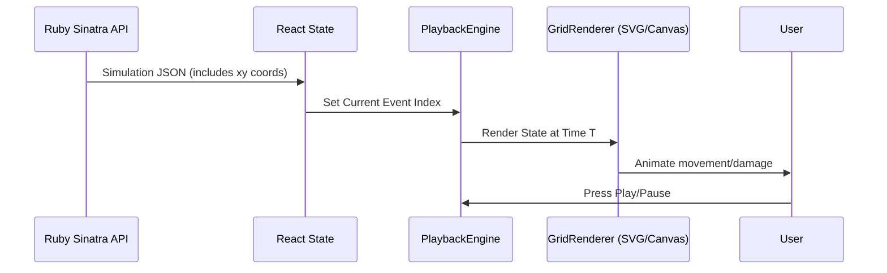

# DESIGN-0009: Visual Combat Playback (Video Game Mode)

## Problem Statement

The current simulator provides excellent statistical data but lacks "Spatial Intuitiveness." It is difficult for users to understand *why* a particular combatant won based solely on a table of DPR numbers. Seeing the kiting, positioning, and AOE effects in action will significantly improve tactical analysis.

## Proposed Solution

Implement a React-based `CombatPlayback` component that uses the `JSONCombatResultHandler` output to animate the simulation.

### Architecture Diagram

## Detailed Design

### Data Protocol Update

The `JSONCombatResultHandler` will be updated to include a `spatial_snapshot` in every round.
- `positions: { "Hero": {x: 0, y: 0, altitude: 0}, "Goblin": {x: 5, y: 5} }`
- Move events will specify the path taken.

### Component Structure (React)

1.  **`CombatViewer`**: Main container.
2.  **`TacticalMap`**: Renders the 5ft square grid using SVG for clean scaling.
3.  **`UnitToken`**: Individual combatant representation (Icon + HP bar).
4.  **`CombatControls`**: Play/Pause/Slider interface.

### Animation Strategy

- **Movement**: CSS Transitions on the SVG group elements for smooth linear interpolation between grid squares.
- **Combat Text**: Transient React components that mount at `(x, y)` and float upwards before unmounting.

## Math Transparency

- **Coordinate Mapping**: 1 grid unit = 5 feet.
- **Time Scaling**: Playback speed (1.0x) will map 1 round to approximately 2 seconds of visual time.

## Static Assets

We will use a set of **Embedded SVG Icons**:
- ⚔️ (Fighter)
- 🧙 (Wizard)
- 💀 (Monster)
- 🏹 (Ranged)
- 🔥 (AOE Effect)

## Implementation Plan

1.  **Backend (Ruby)**: Update `Combat` and `JSONCombatResultHandler` to include spatial data.
2.  **Frontend (React)**: Create the `TacticalMap` rendering engine.
3.  **Frontend (React)**: Implement the interpolation logic to move units between snapshots.
4.  **Polish**: Add HP bars and floating text.
